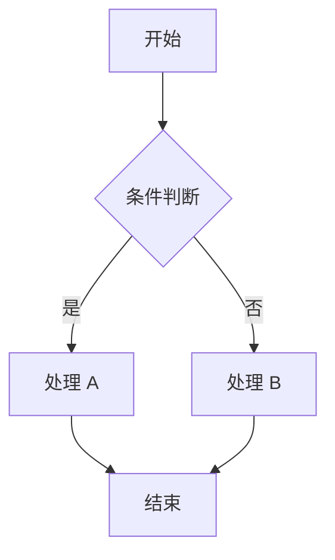

# [功能名称]

## 1. 数据库变更

### 表关系

只画有关联的字段（PK 和 FK），不列全部字段。标注关联基数（1:N / N:1 / N:N）。

```
  table_a              table_b
 ┌──────────┐        ┌──────────────┐
 │ id  (PK) │──1:N──│ field_a (FK) │
 └──────────┘        └──────────────┘
```

### SQL

每条 SQL 用 `--` 注释说明设计意图。新增表、改表、初始化数据分开。

```sql
-- 新建 [表说明] 表
-- [补充设计决策说明，如字段类型选择、索引设计意图]
CREATE TABLE `xxx` (
    `name`          VARCHAR(50)   NOT NULL  COMMENT '名称',
    -- 业务字段 --
    PRIMARY KEY (`id`),
    UNIQUE KEY `uk_name` (`name`)
) COMMENT '[表注释]';

-- [修改说明]
-- [为什么这样改、设计意图]
ALTER TABLE `existing_table` ADD COLUMN `new_field` VARCHAR(50) NULL COMMENT '[字段说明]' AFTER `some_field`;

-- [初始数据说明]
-- INSERT INTO `xxx` (name, ...) VALUES ('默认值', ...);
```

---

## 2. 接口设计

### 汇总

| 接口 | 方法 | 路径 | 权限 |
|------|------|------|------|
| [接口功能描述] | GET / POST / PUT / DELETE | /path | xxx:action |
| ... | | | |

### METHOD /path

**说明**：[接口功能的一句话描述]

**权限码**：`xxx:action`

**入参**

| 参数 | 类型 | 校验 | 说明 |
|------|------|------|------|
| field | String | `@NotBlank` `@Size(max=50)` | 字段说明 |
| field2 | Long | `@NotNull` | |
| page | int | 默认 1 | 分页查询时 |
| size | int | 默认 10 | 分页查询时 |
| orderBy | String | sortKeyMap 白名单 | 分页查询时 |

> 校验列尽量写 JSR303 注解，JSR303 覆盖不了的（如唯一性）不加注解，在业务逻辑中说明。
> `Set<Long>` 等 JSON 类型参数，在"参数"列写明即可，"类型"列写 `Set<Long>`。

**响应**

| 字段 | 类型 | 说明 |
|------|------|------|
| field | String | 字段说明 |

> 无响应的接口填"无"（框架自动包裹 `R<void>`）。
> 分页接口响应类型为 `PageVO<XxxVO>`，然后列出 VO 中的字段。
> 不列分页元数据（current/size/total/pages），这些是框架公共的。

**业务逻辑**

1. 步骤一
2. 步骤二
3. 步骤三

> 简单逻辑用步骤列表。分支多、有判断节点的用 mermaid flowchart：



---

## 3. 页面

**布局**
上搜索 + 下表格 + 弹窗表单（或其他结构）

**搜索区**
搜索字段及控件类型（input / select / date-picker），搜索和重置按钮

**表格列**
列名及宽度、对齐方式。特殊渲染注明（如状态用 tag、开关用 switch）

**新增/编辑**
弹窗还是独立页面。表单字段及控件类型（input / select / date-picker / switch），关联数据的选择方式

**行级控制**
哪些行禁用编辑/删除，条件是什么

**顶部按钮**
新增 / 导出 / 状态批量操作等
