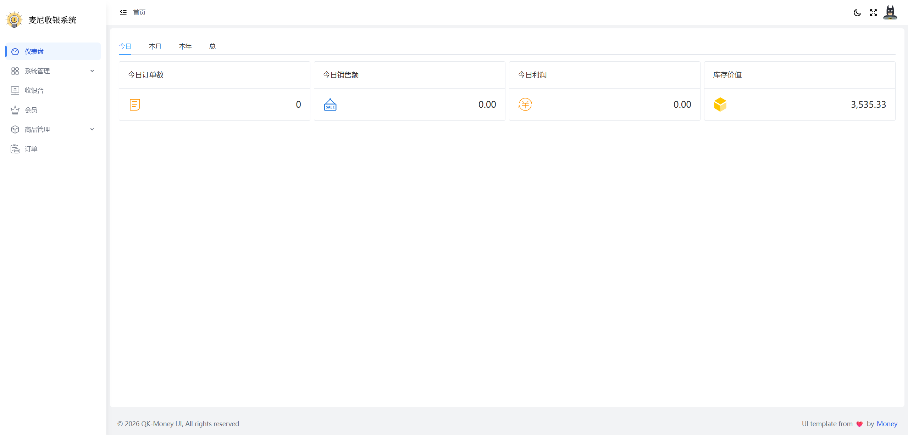
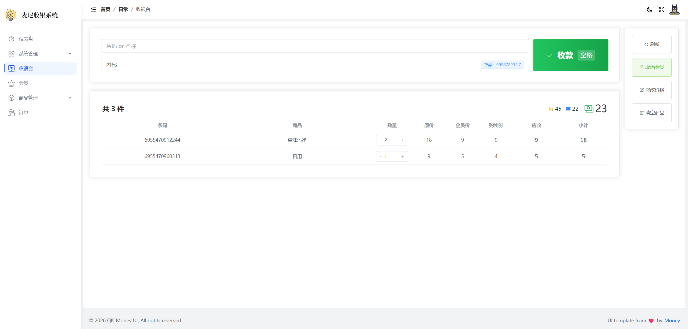
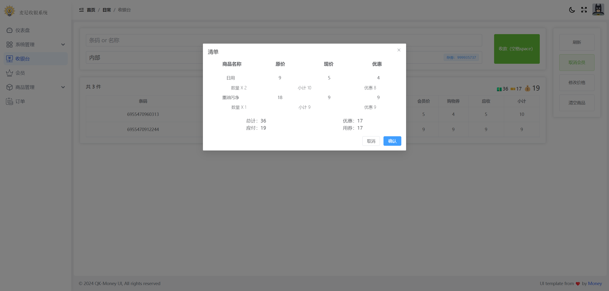
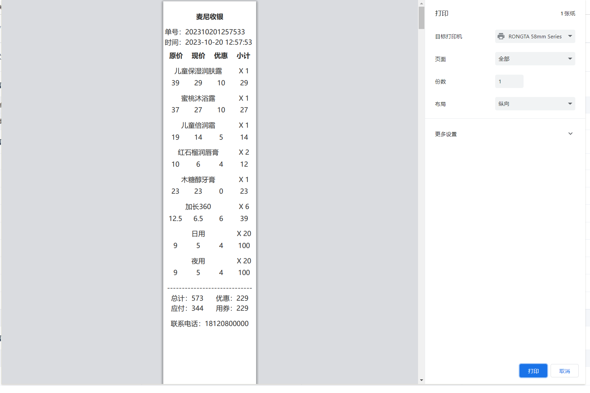
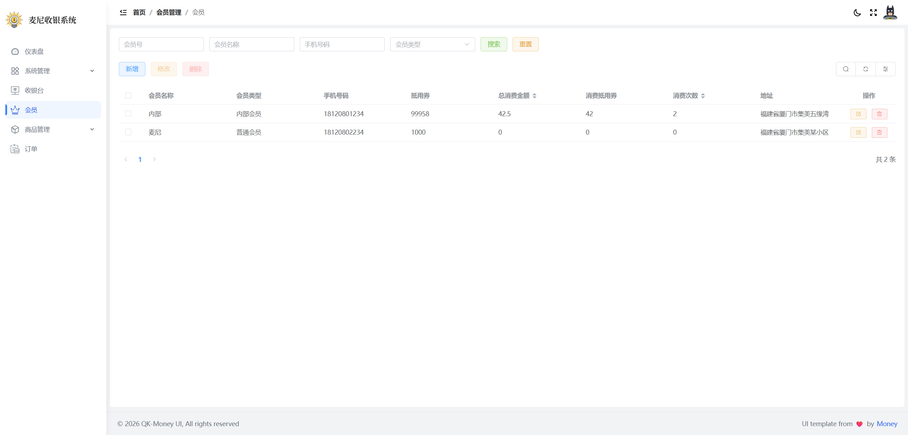
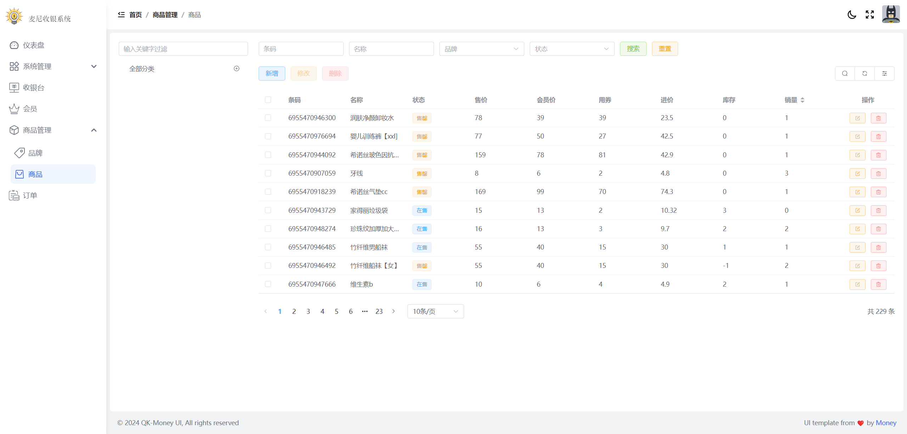
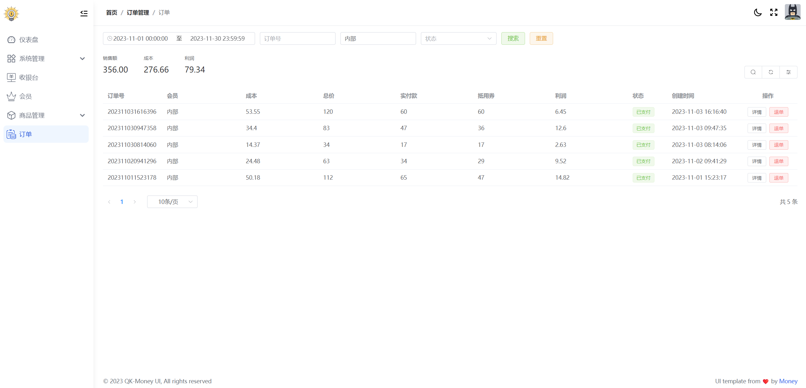
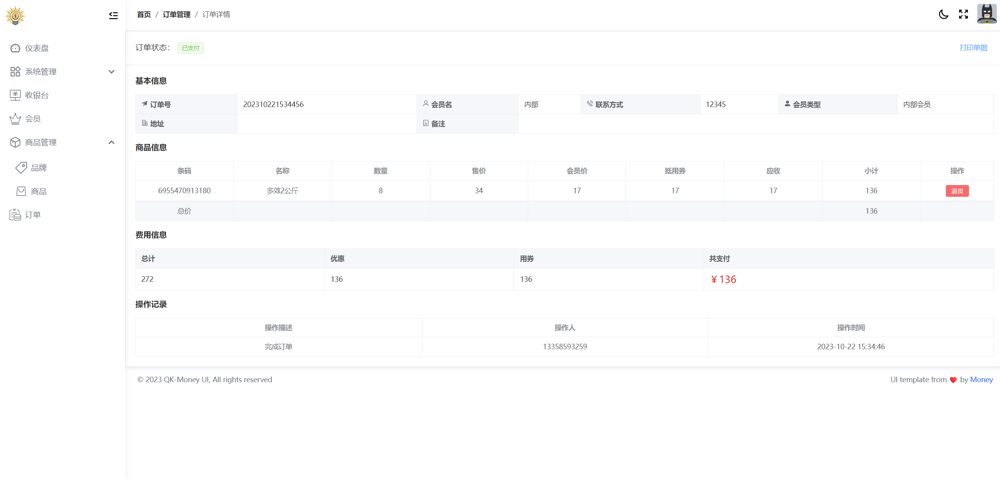

<h3 align="center">💰 麦尼收银系统 </h3>

<p align="center">Money - Spring Boot 2.7 & VueJS 3 Cashier System</p>

> 原 vue2 版本：main-vue2 分支

## 介绍

基于自制快速后台开发框架 [QK-MONEY](https://github.com/ycf1998/qk-money) 开发，自家用的收银系统。[前往体验](http://175.178.102.32/money-pos-demo?tenant=M)

## 功能特性

- [x] 首页简单报表
- [x] 系统管理
    - [x] 用户管理、角色管理、权限管理、字典管理、租户管理（开分店）
- [x] 收银台（支持小票打印）
- [x] 会员管理
- [x] 商品管理（分类、品牌）
- [x] 订单管理

## 环境要求

- JDK 1.8+
- MySQL 8+
- Maven 3.8+
- Node.js 16+

## 技术栈

| 依赖         | 版本   |
| ------------ | ------ |
| Spring Boot  | 2.7.18 |
| MyBatis-Plus | 3.5.7  |
| Hutool       | 5.8.34 |
| JJWT         | 0.11.5 |
| Jackson      | 2.13.5 |
| Spring Doc   | 1.8.0  |
| Qiniu        | 7.13.1 |
| XXL-JOB      | 2.3.1  |

- 本项目的模块版本声明都在根目录下的 `POM.xml`，称为**主 POM**
- 第三方依赖版本声明都在 `qk-money-parent` 包下的 `POM.xml`，称为**清单 POM**

------

后端工程详情：[QK-MONEY](https://github.com/ycf1998/qk-money) 

前端工程详情：[QK-MONEY-UI](https://github.com/ycf1998/qk-money-ui)

## 快速开始

```bash
git clone https://github.com/ycf1998/money-pos.git
```

#### 后端（money-pos）

1. 初始化数据库

    ```sql
    执行 money_pos.sql 创建数据库
    MySQL 8 以下版本，需要全局替换脚本内：
    utf8mb4 -> utf8
    utf8mb4_general_ci -> utf8_general_ci
    ```

2. 修改数据库连接信息 [application-dev.yml](./money-pos/qk-money-app/money-app-biz/src/main/resources/application-dev.yml)

    ```yaml
     # 连接数据库的url
     url: jdbc:mysql://127.0.0.1:3306/money_pos?useUnicode=true&characterEncoding=utf-8&serverTimezone=GMT%2b8&allowPublicKeyRetrieval=true&useSSL=false
     # 连接数据库的账号
     username: root
     # 连接数据库的密码
     password: root
    ```

3. 运行  [QkMoneyApplication](./money-pos/qk-money-app/money-app-biz/src/main/java/com/money/QkMoneyApplication.java)

#### 前端（money-pos-web）

1. 进入目录

    ```bash
    cd money-pos-web
    ```

2. 安装依赖

    ```bash
    npm install
    ```

3. 本地启动

    ```bash
    npm run dev
    ```

## 系统截图
















