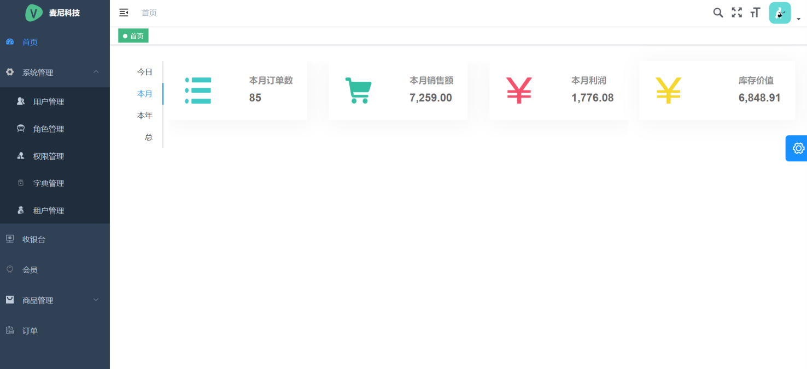
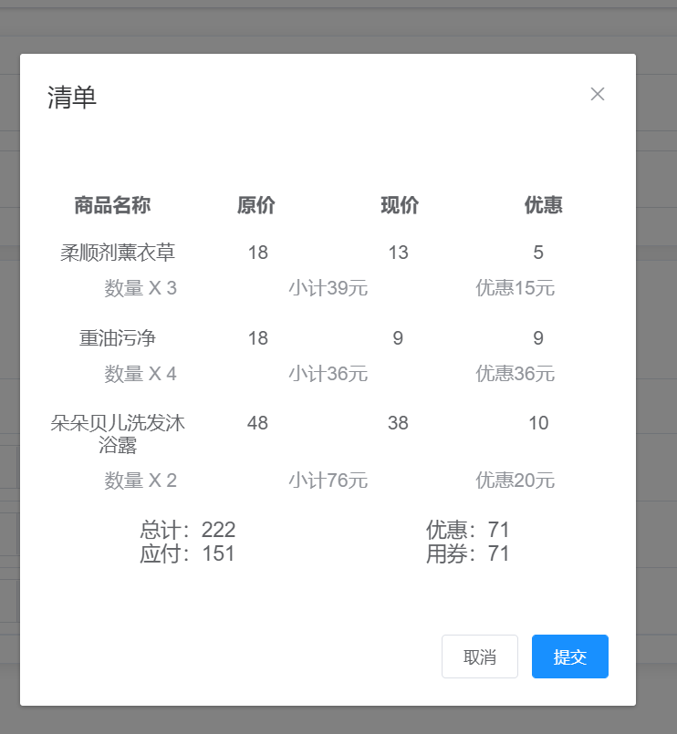
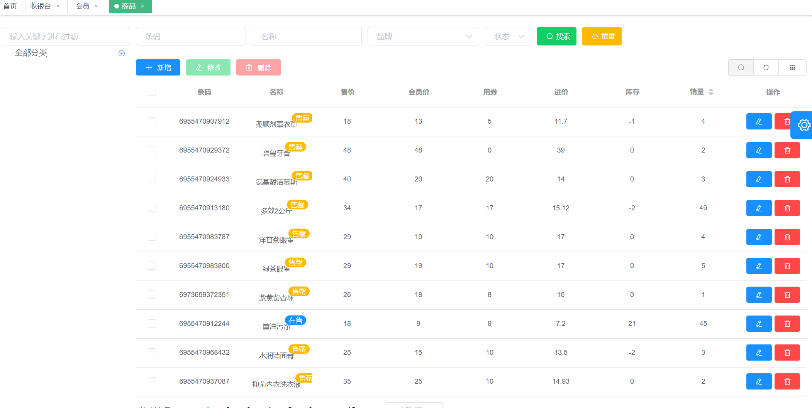
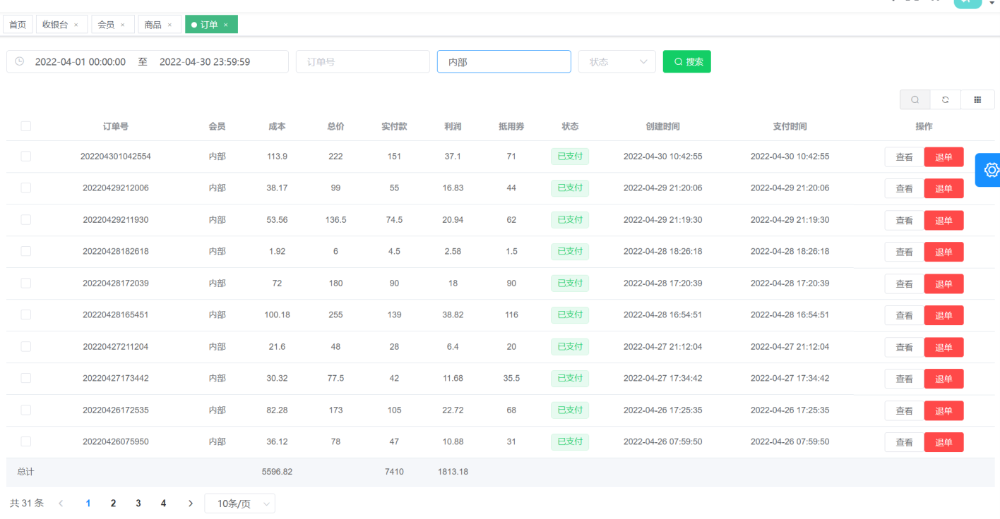

# 麦尼收银系统

​	基于自制轮子[qk-money](https://github.com/ycf1998/qk-money)开发，自家用的收银系统 [体验](http://175.178.102.32/money-pos-demo?tenant=M)

> 体验账号：
>
> - 超级管理员 money 123
> - 管理员 admin 123456
> - 访客 guest 123456

# 版本依赖

| 依赖         | 版本   |
| ------------ | ------ |
| JDK          | 1.8    |
| Maven        | 3.8.1  |
| Spring Boot  | 2.6.10 |
| Mybatis-plus | 3.5.2  |
| JJWT         | 0.11.2 |
| Hutool       | 5.8.4  |
| Jackson      | 2.12.4 |
| Spring Doc   | 1.5.11 |
| Qiniu        | 7.7.0  |
| XXL-JOB      | 2.3.1  |

- 本项目的模块版本声明都在根目录下的`POM.xml`，称为**主POM**
- 第三方依赖版本声明都在`qk-money-parent`包下的`POM.xml`，称为**清单POM**

# 功能清单

- [x] 首页简单报表
- [x] 系统管理
  - [x] 用户管理、角色管理、权限管理、字典管理、租户管理（开分店）

- [x] 收银台（支持小票打印）
- [x] 会员管理
- [x] 商品管理（分类、品牌）
- [x] 订单管理

# 工程结构

| 模块                                     | 描述                                                         |
| ---------------------------------------- | ------------------------------------------------------------ |
| `qk-money-parent`                        | 👉父模块：BOM，依赖版本清单，其他模块都不能写具体版本号，需要新增的依赖要先在这声明版本信息 |
| `qk-money-app`                           | 👉应用模块：**主要开发的模块**                                |
| `qk-money-app`/`money-app-api`           | 应用api模块：放常量枚举、异常、Entity、DTO、VO等实体类       |
| `qk-money-app`/`money-app-biz`           | 应用业务模块：放Controller、Service、Mapper等，**启动类所在** |
| `qk-money-app`/`money-app-system`        | 应用系统模块：提供和前端配套的基于RBAC模型和JWT的权限认证、数据字典等系统管理功能，biz模块默认会引入 |
| `qk-money-common`                        | 👉通用模块：                                                  |
| `qk-money-common`/`money-common-web`     | 通用web模块：**建议至少引入的模块**。 提供默认全局的响应返回、异常处理、请求日志切面、日志链路追踪、多语言、多时区等功能，减少项目的基础构建和规范。 |
| `qk-money-common`/`money-common-mybatis` | Mybatis模块：使用的是`Mybatis-Plus`，默认已配置分页插件、审计字段默认值填充（需继承`BaseEntity`）和**代码生成器**。 |
| `qk-money-common/money-common-cache`     | 缓存模块：支持本地缓存和分布式缓存`Redis`                    |
| `qk-money-common/money-common-mail`      | 邮件模块：提供邮件发送功能                                   |
| `qk-money-common/money-common-schedule`  | 定时任务模块：提供集成XXL-JOB定时任务                        |
| `qk-money-common`/`money-common-oss`     | OSS对象存储模块：提供本地文件OSS和七牛云OSS                  |
| `qk-money-common/money-common-swagger`   | 接口文档模块：提供Open API 3（Swagger）                      |
| `qk-money-security`                      | 👉安全模块：使用Spring Security框架，基于RBAC模型和JWT赋予认证授权能力 |
| `qk-money-tenant`                        | 👉多租户模块：基于`Mybatis Plus`多租户插件实现多租户功能      |
| `xxl-job-admin`                          | 👉XXL-JOB调度中心：[官方文档](https://www.xuxueli.com/xxl-job)，简单使用看定时任务模块文档即可 |

# 截图

