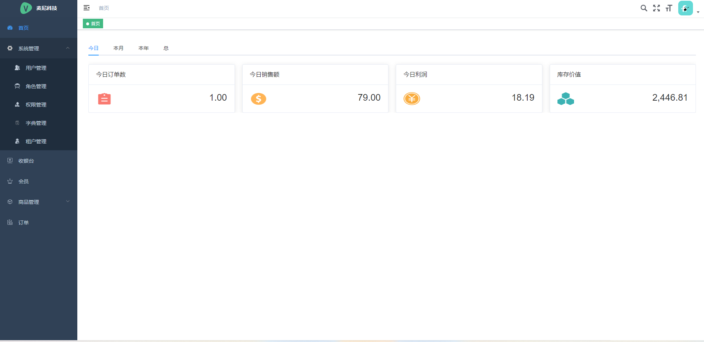
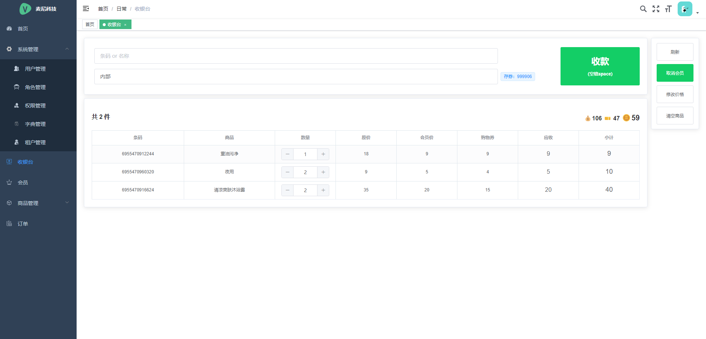
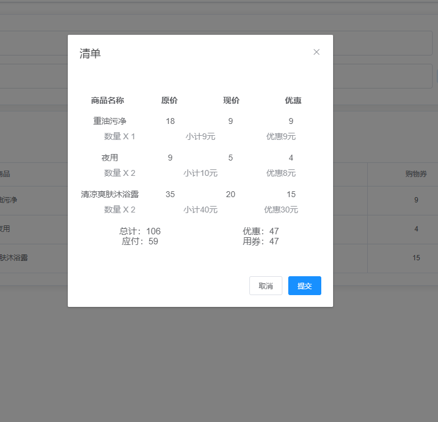
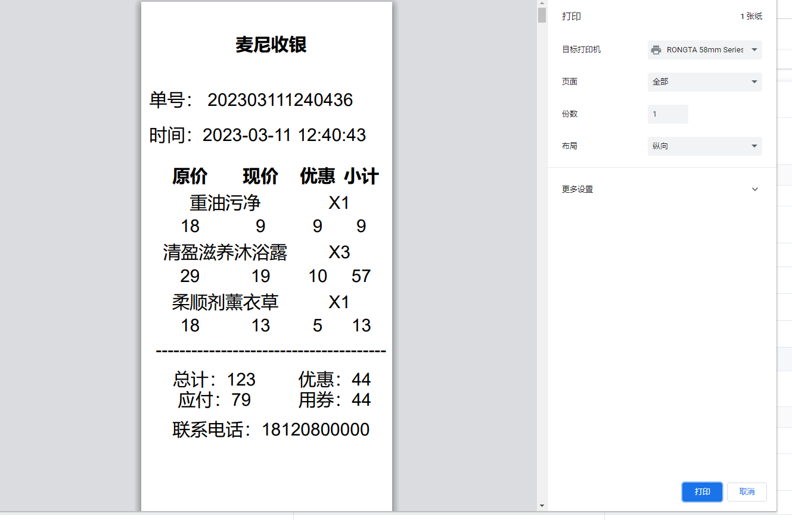
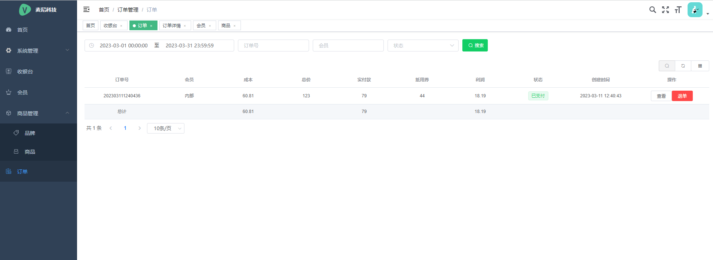
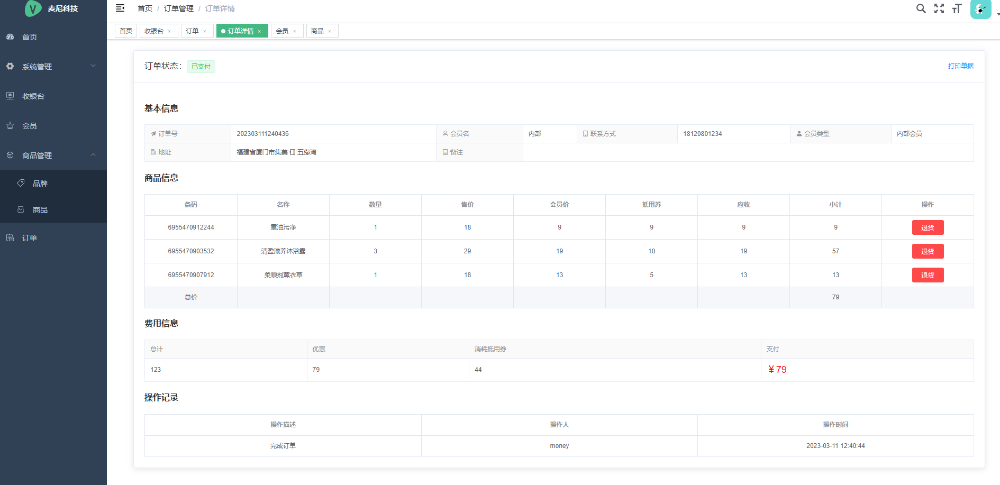

# 麦尼收银系统

基于自制轮子 [QK-MONEY](https://github.com/ycf1998/qk-money) 开发，自家用的收银系统。 [前往体验](http://175.178.102.32/money-pos-demo?tenant=M)

> 体验账号：
>
> - 超级管理员 money 123
> - 管理员 admin 123456
> - 访客 guest 123456

# 版本依赖

| 依赖         | 版本   |
| ------------ | ------ |
| JDK          | 1.8    |
| Maven        | 3.8.1  |
| Spring Boot  | 2.6.10 |
| Mybatis-plus | 3.5.2  |
| JJWT         | 0.11.2 |
| Hutool       | 5.8.4  |
| Jackson      | 2.12.4 |
| Spring Doc   | 1.5.11 |
| Qiniu        | 7.7.0  |
| XXL-JOB      | 2.3.1  |

- 本项目的模块版本声明都在根目录下的 `POM.xml`，称为**主 POM**
- 第三方依赖版本声明都在 `qk-money-parent` 包下的 `POM.xml`，称为**清单 POM**

# 功能清单

- [x] 首页简单报表
- [x] 系统管理
  - [x] 用户管理、角色管理、权限管理、字典管理、租户管理（开分店）

- [x] 收银台（支持小票打印）
- [x] 会员管理
- [x] 商品管理（分类、品牌）
- [x] 订单管理

# 工程介绍

| 模块                                                         | 描述                                                         |
| ------------------------------------------------------------ | ------------------------------------------------------------ |
| `qk-money-parent`[📜](./doc/qk-money-parent.md)               | 👉**父模块：BOM（依赖版本清单）**。<br />建议其他模块依赖不写具体版本号，第三方依赖版本均在此声明，统一管理。 |
| `qk-money-app`                                               | 👉**应用模块：主要开发的模块**                                |
| `qk-money-app`/`money-app-api`                               | 应用 API 模块：放常量枚举、异常、Entity、DTO、VO 等。        |
| `qk-money-app`/`money-app-biz`                               | 应用业务模块：Controller、Service、Mapper 等，启动类所在。   |
| `qk-money-app`/`money-app-system`                            | 系统管理模块：QK-MOENY 预设的一套权限管理系统，单独模块方便拆卸。 |
| `qk-money-common`                                            | 👉**通用模块：各种方便易用的功能包**                          |
| `qk-money-common`/`money-common-web`[📜](./doc/money-common-web.md) | 通用 Web 模块： Web 开发的核心模块。<br />提供默认的全局响应处理、异常处理、请求日志切面、日志链路追踪、多语言、多时区等功能，减少 Web 项目的基础构建。 |
| `qk-money-common`/`money-common-mybatis`[📃](./doc/money-common-mybatis.md) | MyBatis 模块：使用 MyBatis-Plus 增强库，默认配置分页插件、审计字段默认值填充（需继承 `BaseEntity`）和代码生成器。 |
| `qk-money-common/money-common-cache`                         | 缓存模块：提供本地缓存和集中式缓存 Redis。                   |
| `qk-money-common/money-common-mail`[📃](./doc/money-common-mail.md) | 邮件模块：提供邮件发送功能。                                 |
| `qk-money-common/money-common-schedule`[📃](./doc/money-common-schedule.md) | 定时任务模块：提供集成 XXL-JOB 定时任务。                    |
| `qk-money-common`/`money-common-oss`[📃](./doc/money-common-oss.md) | OSS 对象存储模块：提供本地文件存储和七牛云对象存储。         |
| `qk-money-common/money-common-swagger`[📃](./doc/money-common-swagger.md) | 接口文档模块：提供 Swagger 接口文档集成（OpenAPI 3）。       |
| `qk-money-security`[📃](./doc/qk-money-security.md)           | 👉**安全模块**：基于 Spring Security 框架封装，提供基于 Token 和 RBAC 模型的认证授权能力。 |
| `qk-money-tenant`[📃](./doc/qk-money-tenant.md)               | 👉**多租户模块**：使用 MyBatis-Plus 多租户插件实现的基于表字段的多租户功能。 |
| `xxl-job-admin`                                              | 👉**XXL-JOB 调度中心**：[官方文档](https://www.xuxueli.com/xxl-job)，简单使用看定时任务模块文档即可。 |

> 点击📃查看对应模块使用文档，📜开发前建议先看。

# 本地启动

1. 执行根目录下 money_pos.sql 文件，创建并初始化数据库。

2. 后端工程 money-pos，启动 qk-money-app/money-app-biz 下主类 `QkMoneyApplication`。

    > 记得修改 application-dev.yml 里数据库连接信息

3. 前端工程 money-pos-web，到工程目录下执行以下终端命令。

    ```bash
    # 安装依赖
    npm install
    # 本地启动
    npm run dev
    ```

# 截图













