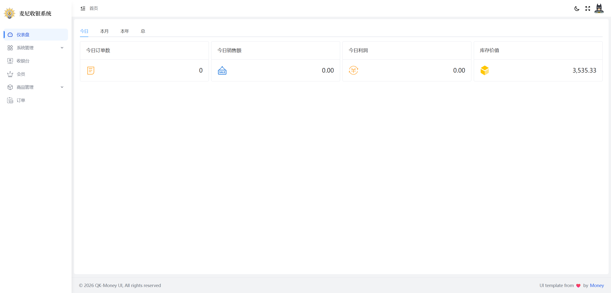
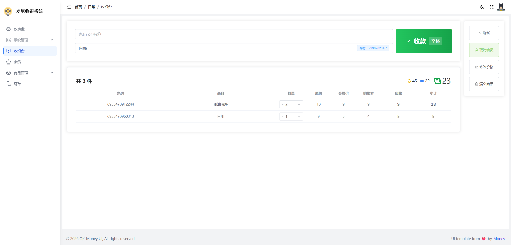
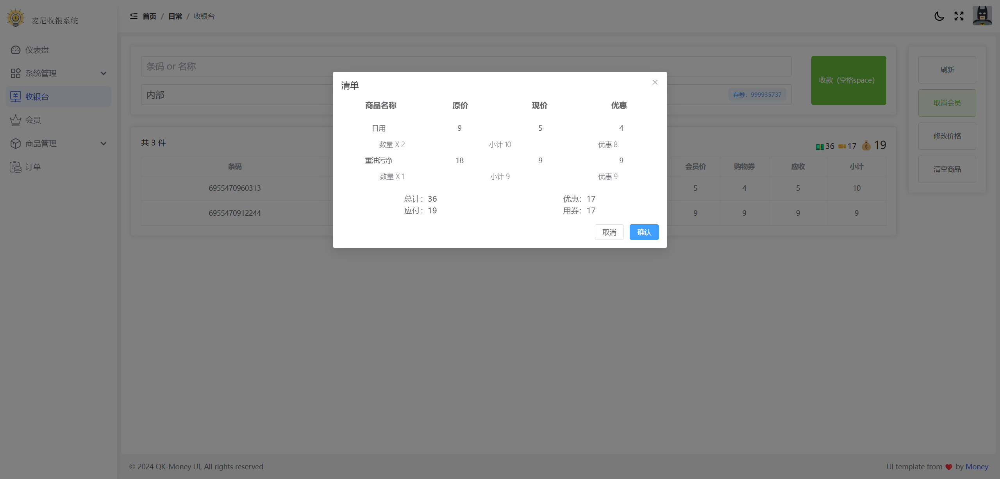
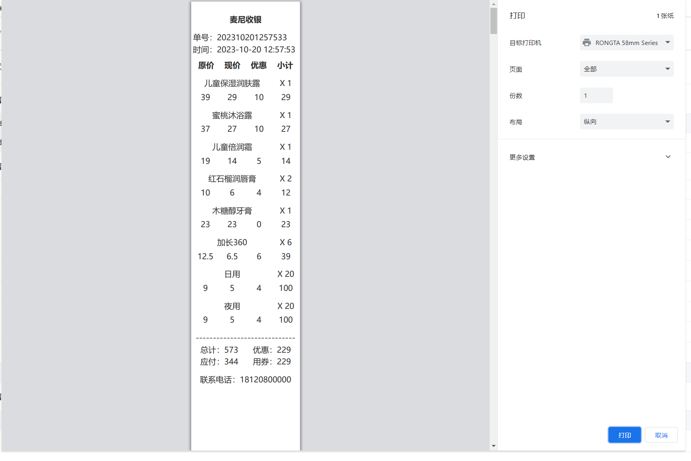
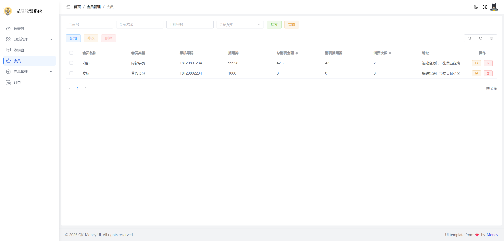
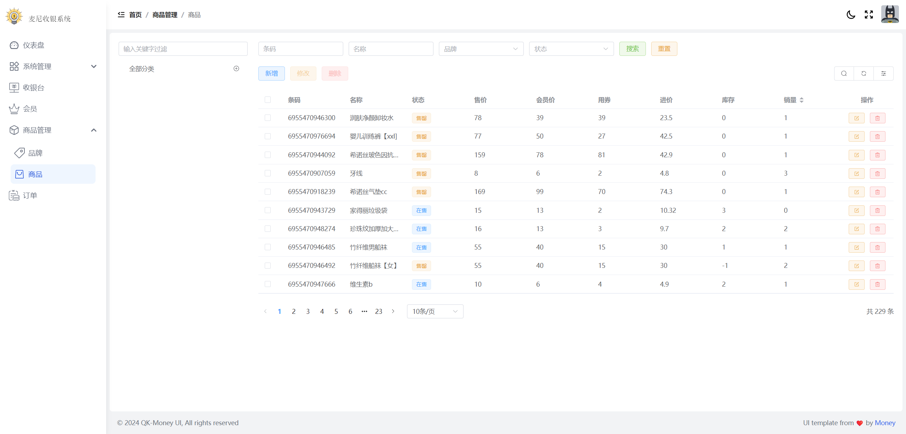
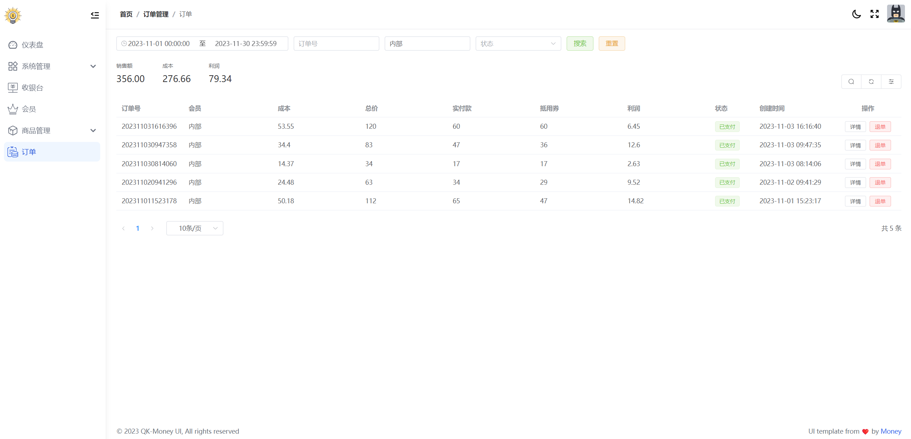
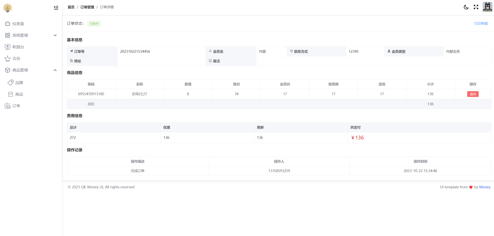

<h1 align="center">💰 麦尼收银系统</h1>

<p align="center">
  <strong>Money POS - 基于 Spring Boot 2.7 & VueJS 3 的多店铺收银系统</strong>
</p>

<p align="center">
  <a href="https://spring.io/projects/spring-boot" target="_blank">
    
  </a>
  <a href="https://vuejs.org/" target="_blank">
    
  </a>
  <a href="https://element-plus.org/" target="_blank">
    
  </a>
  <a href="https://baomidou.com/" target="_blank">
    
  </a>
  <a href="https://www.oracle.com/java/" target="_blank">
    
  </a>
  <a href="https://opensource.org/licenses/MIT" target="_blank">
    
  </a>
</p>

<p align="center">
  <a href="http://114.132.70.84/money-pos-demo?tenant=M">👉 在线体验</a>
  ·
  <a href="#快速开始">🚀 快速开始</a>
  ·
  <a href="#核心功能">✨ 核心功能</a>
</p>

## 📖 项目简介

麦尼收银系统（Money POS）是一款基于自制快速后台开发框架 [QK-MONEY](https://github.com/ycf1998/qk-money) 开发的多店铺收银系统。系统支持**会员管理**、**商品管理**、**订单管理**等功能，并集成了**小票打印**等实用特性，适用于零售、餐饮等多种场景。

> 💡 **JDK 1.8 用户**：如需使用 **JDK 1.8 + Spring Boot 2.7** 版本，请切换到 [`jdk1.8`](https://github.com/ycf1998/qk-money/tree/jdk1.8) 分支。

## ✨ 核心功能

<table>
  <tr>
    <th>模块</th>
    <th>功能描述</th>
  </tr>
  <tr>
    <td align="center">📊 <b>首页报表</b></td>
    <td>销售数据概览，营收、订单量等基础统计</td>
  </tr>
  <tr>
    <td align="center">🛒 <b>收银台</b></td>
    <td>快速收银流程、小票打印、节日主题皮肤</td>
  </tr>
  <tr>
    <td align="center">👥 <b>会员管理</b></td>
    <td>会员信息、会员等级、抵用券管理、消费记录追踪</td>
  </tr>
  <tr>
    <td align="center">🛍️ <b>商品管理</b></td>
    <td>商品分类、品牌管理、商品信息（条码、进价、售价、会员价、库存等）</td>
  </tr>
  <tr>
    <td align="center">📦 <b>订单管理</b></td>
    <td>订单查询与筛选、订单详情、订单统计、退单/退货处理、订单日志</td>
  </tr>
  <tr>
    <td align="center">⚙️ <b>系统管理</b></td>
    <td>用户管理、角色管理、权限管理、字典管理、租户管理</td>
  </tr>
</table>

## 🛠️ 技术栈

### 后端技术

<table>
  <tr>
    <th>技术</th>
    <th>版本</th>
    <th>说明</th>
  </tr>
  <tr>
    <td><b>Spring Boot</b></td>
    <td>3.5.12</td>
    <td>核心框架</td>
  </tr>
  <tr>
    <td><b>MyBatis-Plus</b></td>
    <td>3.5.15</td>
    <td>ORM 持久层框架</td>
  </tr>
  <tr>
    <td><b>Spring Security</b></td>
    <td>3.5.12</td>
    <td>安全认证</td>
  </tr>
  <tr>
    <td><b>Hutool</b></td>
    <td>5.8.43</td>
    <td>工具类库</td>
  </tr>
  <tr>
    <td><b>MySQL</b></td>
    <td>8.0+</td>
    <td>数据库</td>
  </tr>
</table>

### 前端技术

<table>
  <tr>
    <th>技术</th>
    <th>说明</th>
  </tr>
  <tr>
    <td><b>Vue 3</b></td>
    <td>渐进式 JavaScript 框架</td>
  </tr>
  <tr>
    <td><b>Vue Router</b></td>
    <td>官方路由管理器</td>
  </tr>
  <tr>
    <td><b>Pinia</b></td>
    <td>轻量级状态管理库</td>
  </tr>
  <tr>
    <td><b>Element Plus</b></td>
    <td>基于 Vue 3 的 UI 组件库</td>
  </tr>
  <tr>
    <td><b>TailwindCSS</b></td>
    <td>实用优先的 CSS 框架</td>
  </tr>
  <tr>
    <td><b>Vite</b></td>
    <td>下一代前端构建工具</td>
  </tr>
</table>

## 📋 环境要求

<table>
  <tr>
    <th>环境</th>
    <th>版本要求</th>
  </tr>
  <tr>
    <td><b>JDK</b></td>
    <td>17+</td>
  </tr>
  <tr>
    <td><b>MySQL</b></td>
    <td>8.0+</td>
  </tr>
  <tr>
    <td><b>Maven</b></td>
    <td>3.8+</td>
  </tr>
  <tr>
    <td><b>Node.js</b></td>
    <td>16+</td>
  </tr>
</table>

## 🚀 快速开始

### 1️⃣ 克隆项目

```bash
git clone https://github.com/ycf1998/money-pos.git
cd money-pos
```

### 2️⃣ 初始化数据库

执行 `money_pos.sql` 脚本创建数据库：

```bash
mysql -u root -p < money_pos.sql
```

> ⚠️ **注意**：如果使用 MySQL 8 以下版本，请将脚本中的 `utf8mb4` 替换为 `utf8`，`utf8mb4_general_ci` 替换为 `utf8_general_ci`。

### 3️⃣ 配置数据库连接

编辑 `qk-money-app/money-app-biz/src/main/resources/application-dev.yml`：

```yaml
spring:
  datasource:
    url: jdbc:mysql://127.0.0.1:3306/money_pos?useUnicode=true&characterEncoding=utf-8&serverTimezone=GMT%2b8&allowPublicKeyRetrieval=true&useSSL=false
    username: root
    password: your_password
```

### 4️⃣ 启动后端服务

运行 [
`QkMoneyApplication`](money-pos/qk-money-app/money-app-biz/src/main/java/com/money/QkMoneyApplication.java) 启动项目。

### 5️⃣ 启动前端服务

```bash
cd money-pos-web
npm install
npm run dev
```

### 6️⃣ 成功启动

访问：`http://localhost:1520/money-pos`

## 🖼️ 系统截图

<div align="center">
  <h3>📊 首页仪表盘</h3>
  

  <h3>🛒 收银台</h3>
  

  <h3>💳 收银结算</h3>
  

  <h3>🧾 小票打印</h3>
  

  <h3>👥 会员管理</h3>
  

  <h3>🛍️ 商品管理</h3>
  

  <h3>📦 订单管理</h3>
  

  <h3>📋 订单详情</h3>
  
</div>

---

<p align="center">
  <strong>🎉 感谢使用麦尼收银系统！</strong>
</p>
