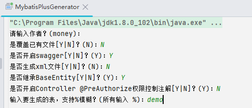

# MyBatis模块

​		该模块集成持久化框架MyBatis 并引入Mybatis-Plus 进行增强。提供**代码生成器**和常用插件配置。

## 依赖

~~~xml
<!-- 持久层 -->
<dependency>
    <groupId>com.money</groupId>
    <artifactId>money-common-mybatis</artifactId>
</dependency>
~~~

## 审计字段自动填充

​		实体类继承`BaseEntity` 使用MyBatis-Plus API进行操作时会自动填充`id（雪花ID）`、`create_by`、`create_time（当前时间）`、`update_by`、`update_by（当前时间）` 字段，其中`create_by`和`update_by` 默认为""，可通过注入`Operator` Bean来进行提供，如我们引入安全模块，可以从上下文获取当前登录人

~~~java
@Primary
@Bean
public Operator operator() {
    return () -> SecurityGuard.isLoggedState() ? SecurityGuard.getRbacUser().getUsername() : "";
}
~~~

## 代码生成器

`MybatisPlusGenerator`，修改该类的`url`、`username`、`password`的连接信息，运行main函数即可。生成器以交互的方式进行代码生成，

生成基础CRUD，结构如下：

# 相关链接

[MyBatis](https://mybatis.org/mybatis-3/)

[MyBatis-Plus](https://baomidou.com/)
