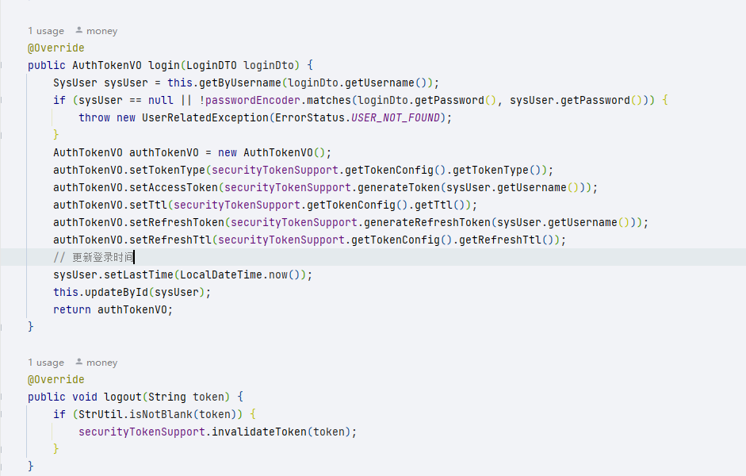
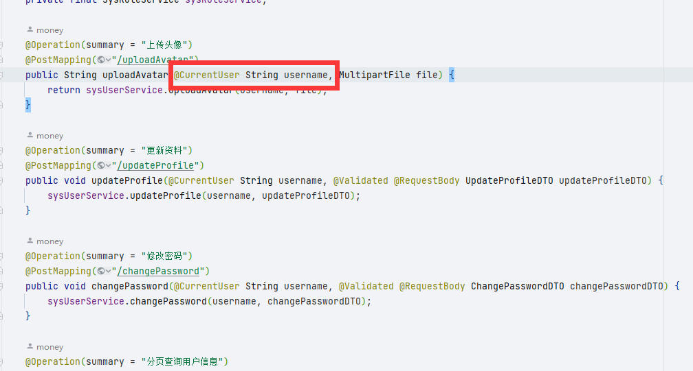
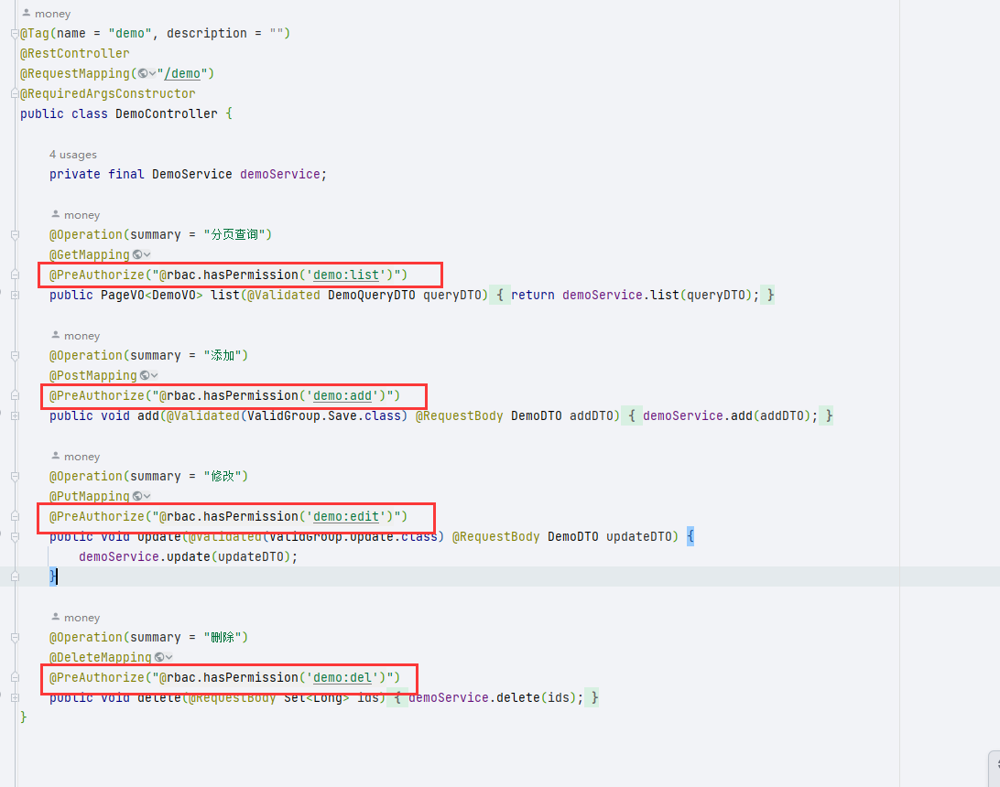

# 安全模块

​		认证鉴权是每个项目最基础的功能，但是在配置和使用上相对复杂，于是通过封装Spring Security ，提供基于token（JWT）的认证和基于 RBAC 权限模型的鉴权能力，让项目能更便捷的拥有该能力。

> money-app-system其实就是该模块的一个实现

## 依赖

~~~xml
<!-- 安全模块 -->
<dependency>
    <groupId>com.money</groupId>
    <artifactId>qk-money-security</artifactId>
</dependency>
~~~

## 接入

​		提供配置类`RbacSecurityConfig`。模块并不关心你的数据库是如何设计的，它只需要你提供一个`RbacUser`。

~~~java
@Bean
public RbacSecurityConfig rbacSecurityConfig() {
    return username -> {
        SysUser sysUser = Optional
            .ofNullable(sysUserService.getByUsername(username))
            .orElseThrow(() -> new UsernameNotFoundException("用户名或密码错误"));
        List<SysRole> roles = sysUserService.getRoles(sysUser.getId());
        List<String> roleCodeList = roles
            .stream().map(SysRole::getRoleCode).collect(Collectors.toList());
        List<String> permissions = sysUserService.getPermissions(sysUser.getId())
            .stream().map(SysPermission::getPermission).collect(Collectors.toList());
        // 返回装填的rbac user
        RbacUser rbacUser = new RbacUser();
        // 用户id
        rbacUser.setUserId(sysUser.getId());
        // 用户名
        rbacUser.setUsername(sysUser.getUsername());
        // 用户密码
        rbacUser.setPassword(sysUser.getPassword());
        // 是否启用
        rbacUser.setEnabled(sysUser.getEnabled());
        // 角色
        rbacUser.setRoles(roleCodeList);
        // 权限码
        rbacUser.setPermissions(permissions);
        return rbacUser;
    };
}
~~~

## 相关配置

~~~yaml
money:
  # 安全
  security:
    # token配置
    token:
      # token请求头名称
      header: Authorization
      # 令牌类型：完整token："{tokenType} {accessToken}"
      token-type: Bearer
      # 密钥
      secret: money
      # access token过期时间 ms，默认8小时
      ttl: 28800000
      # refresh token过期时间 ms，默认30天
      refresh-ttl: 2592000000
      # 策略：jwt（自动过期，默认）、redis
      strategy: jwt
      # 缓存键名
      cache-key: "security:token:"
    # 忽略的url
    ignore:
      get:
        - /tenants/byCode
        - /auth/refreshToken
      post:
        - /auth/login
        - /auth/logout
      pattern:
        - /error/**
        - /actuator/**
        - /swagger**/**
        - /webjars/**
        - /v3/**
        - /assets/**
        - /test/**
~~~

## 认证

​		认证主要由过滤器`JwtAuthenticationFilter` 实现，过程如下

1. 获取头部的token
2. 解析出用户名
3. 调用配置的 `RbacSecurityConfig` 进行认证
4. 认证成功，用户信息放入上下文

### Token

~~~java
// 注入该类使用
private final SecurityTokenSupport securityTokenSupport;
~~~

该类提供了生成、刷新、删除、验证、获取Token配置的方法。用户登录后，通过该类生成token，如

对于过期，如果策略使用的是`jwt`是无法手动过期的，`redis` 策略才能手动过期。策略也可以自己扩展，实现 `TokenStrategy` 即可，如`redis`策略实现如下：

然后配置文件中策略名改为你设置的havingValue即可。

~~~java
@Component
@ConditionalOnProperty(prefix = "money.security.token", name = "strategy", havingValue = "redis")
@RequiredArgsConstructor
public class TokenStrategyByRedis implements TokenStrategy {

    private final StringRedisTemplate redisTemplate;

    @Override
    public void saveToken(String key, String token, long timeout, TimeUnit unit) {
        redisTemplate.opsForValue().set(key, token, timeout, unit);
    }

    @Override
    public boolean isExpired(String key, @NonNull String targetToken) {
        String token = redisTemplate.opsForValue().get(key);
        return !targetToken.equals(token);
    }

    @Override
    public void invalidateToken(String key, String token) {
        redisTemplate.delete(key);
    }
}
~~~

### 密码加密器

~~~java
// 注入该类使用
private final PasswordEncoder passwordEncoder;
~~~

### 获取当前用户信息

1. 通过上下文持有者 `SecurityGuard` 安全保安

    ~~~java
    SecurityGuard.getRbacUser()
    ~~~

2. 通过Controller的入参注解@CurrentUser

    > ~~~java
    > /**
    >  * @author : money
    >  * @version : 1.0.0
    >  * @description :
    >  * 在controller的方法入参上添加该注解，则注入当前登录人信息
    >  * 参数类型为 {@link com.money.security.model.RbacUser} 注入RbacUser
    >  * 参数类型为 Long 注入用户id
    >  * 参数类型为 String 注入用户名
    >  * @createTime : 2022-03-26 11:47:33
    >  */
    > @Target(ElementType.PARAMETER)
    > @Retention(RetentionPolicy.RUNTIME)
    > public @interface CurrentUser {
    > }
    > ~~~
    >
    > 

## 鉴权

​		鉴权的核心类是`RbacAuthorityService`，其原理就是通过配置的 `RbacSecurityConfig` 返回的`RbacUser`中的角色和权限码与**注解**提供的权限码比较来判断是否放行。

注解都是Spring Security 提供的注解，更多使用查阅其相关资料即可。
