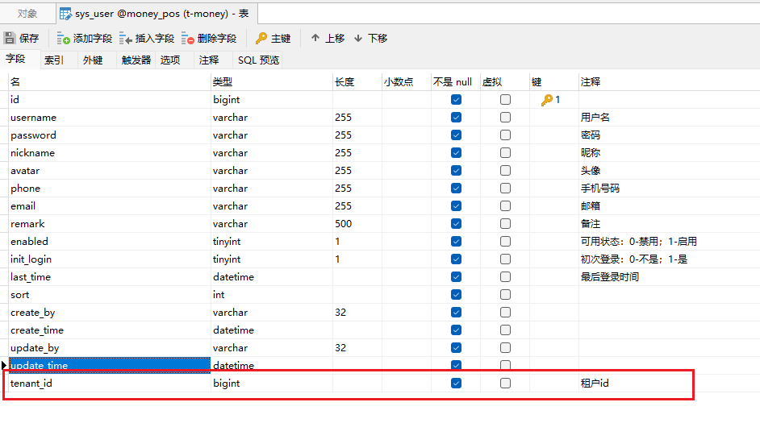
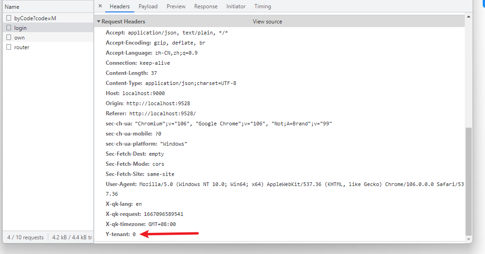

# 租户模块

​		该模块使用`Mybatis-Plus`多租户插件提供基于**表字段**的多租户功能。需要为进行隔离的数据表添加 `tenant_id`字段，开启多租户后，所有执行的`Mybatis-Plus`方法sql都会自动进行过滤处理，无需显式添加条件。对于自写的sql按照规范书写依旧能自动处理（sql涉及到多个表的每个表都要给别名，特别是 inner join 的要写标准的 inner join）。

## 依赖

~~~xml
<!-- 多租户模块 -->
<dependency>
    <groupId>com.money</groupId>
    <artifactId>qk-money-tenant</artifactId>
</dependency>
~~~

## 使用

1. 为需要租户的表添加`tenant_id`字段

    

2. 配置不需要租户的表

    ~~~yaml
    money:
      # 多租户
      tenant:
        # 开关
        enabled: true
        # 请求头
        header: Y-tenant
        # 默认租户id
        default-tenant-id: "0"
        # 忽略的表
        ignore-table:
          - sys_tenant
          - sys_dict
          - sys_dict_detail
    ~~~

3. 前端请求时请求头携带租户id

    

### 获取当前租户id

​		使用租户上下文`TenantContextHolder`

~~~java
Long tenantId = TenantContextHolder.getTenant();
~~~

# 延伸阅读

[Mybatis-Plus多租户插件](https://baomidou.com/pages/aef2f2/#tenantlineinnerinterceptor)

