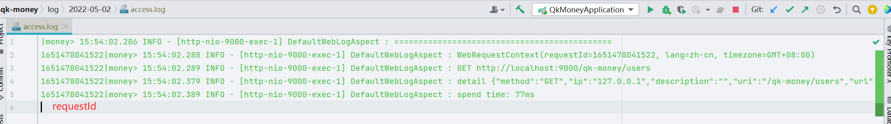

# money-common-web(通用web模块)

​		该模块提供web开发的一些通用能力和配置，减少项目的基础构建和规范，是建议至少引入的模块。包括默认全局响应返回、默认全局异常处理、请求日志切面、日志链路追踪、多语言、多时区等。

## 依赖

~~~xml
<!-- web模块-->
<dependency>
    <groupId>com.money</groupId>
    <artifactId>money-common-web</artifactId>
</dependency>
~~~

## 功能结构

每个功能的核心类都在对应的包里。

### constant（常量）

​		`qk-money`通用常量

### config（配置）

​		提供默认web配置，如支持日期转换配置、Jackson配置、跨域。

### log（日志相关）

​		提供默认全局访问日志切面`DefaultWebLogAspect`，将一次访问的相关信息输出日志。日志单独放在 log/${date}/access.log

### context（请求上下文）

​		提供web请求上下文`WebRequestContext`，包括`requestId(链路追踪)`、`lang(语言)`、`timezone(时区)`。**默认日志切面**会从**请求头**取得信息，并交由`WebRequestContextHolder`管理。所以**上下文需开启默认日志切面才能使用**。

> 请求头键名在`WebRequestConstant`里，并没有提供配置修改。若需使用别的请求头键值直接修改`WebRequestConstant`里相应的常量。

- `requestId`（提供日志链路追踪使用）

  - 如**log**描述的图片，请求日志里最前面会打印`requestId`，在排查线上问题时，可以在前端F12查看请求中请求头的`requestId`，在查看日志时用grep进行过滤。这样做是因为日志是异步打印，线上环境没法阻止其他人请求，会导致日志混在一起不好排查，而通过grep requestId就可以捞到这次请求的所有日志。

- `lang`（客户端语言，为了支持国际化多语言）

- `timezone`（客户端时区，为了支持国际化多时区）

  这两个国际化的支持，当遇到了一些默认提供的支持无法处理的情况，可以自己取出来进行特殊处理。如时区是对返回的数据进行时间转换重写，而对于一些数据量巨大，或有特殊的处理，可以从持有者取出来客户端时区，直接在sql里根据时区查询。

~~~java
WebRequestContextHolder.getContext().getLang(); // 获取上下文的语言环境
~~~

### response（全局响应）

​		提供默认全局响应处理器`DefaultResponseHandler`。该处理器的作用是将Controller的返回值包装在`R<T>`中进行返回，这样的好处是Controller开发中无需显示的返回`R<T>`，开启后如果该请求不需要进行包装，可在类或者方法上添加注解`IgnoreGlobalResponse`。**而对于非200，建议用抛异常的方式让全局异常处理返回，而不要自己包装非200的`R`**

`R<T>`结构如下

~~~json
{
    "code": 200,
    "data": T,
    "message": "操作成功"
}
~~~

### exception（全局异常）

​		提供默认全局异常处理器`DefaultExceptionHandler`、和基础异常`BaseException`。所有的业务异常均抛`BaseException`或其子类（可自己继承去进行更细粒度的业务异常区分）。开启后，所有的异常都会被捕获并包装在`R<T>`中返回。

### i18n（多语言）

​		提供国际化多语言能力，开启后返回的`R<T>`(默认全局异常捕获后返回的也是`R<T>`)里的message**会根据**请求头里客户端设置的语言**从相对应的**多语言映射文件**中获取并返回对应的语言内容。

所以他需要的**前置条件**有：

- 开启多语言，配置支持的语言（配置项见相关配置）
  - 未传请求头或找不到支持的语言将原内容返回

- 开启默认全局异常处理器（抛出异常信息）和默认全局响应处理器（返回的信息）
- 维护多语言映射文件（路径：classpath:i18n/message_{自己配置的支持语言}.properties）

核心类`I18nSupport`，可使用`I18nSupport.get(key)`硬编码方式获取内容，这可以用于应对内容中有变量的消息提示。

> 开启多语言后，项目启动便会加载多语言文件；相对于使用变量的方式，配置文件中我是直接把中文当成key（可能会有字符问题吧，当前是没遇到，idea记得设置文件编码为utf-8），这样我在平常的开发还是使用中文，除了需要变量拼接的信息外，完全不用额外关心多语言，还要取变量名...由全局异常处理器和全局响应处理器最终返回给用户前进行映射转换。

### timezone（多时区）

​		提供多时区能力，**默认东八区**，前端携带请求头提供客户时区。原理就是一个切面（TimeZoneAspect），对标注了`@TZProcess`的类的入参（需标注`@TZParam`）和返回值（需标注`@TZRep`）进行时区处理。对于入参是将客户时区转为默认时区，出参是将默认时区转为客户时区，这样保证了进入方法后的所有操作数据都在默认时区。

> 比如客户是东九区，那他在页面操作的时间都是东九区的时间，所以对于入参我们得转为东八，保证无论客户哪个时区，我们进行操作和存入数据库的时间都是东八区，然后返回的时候将数据洗成客户对应的时区展示。

默认转换器使用的转换工具类是`TimeZoneUtil`，也可以自定义转换器通过注解的`converter()`参数传入。

目前支持的数据类型：

- LocalDateTime
- String（如2022-05-13 13:15:00，格式可自定义但需是日期时间）
- Map（对包含time或者date的键进行转换）
- List（递归对泛型类型是目前支持的类型转换）
- PageVO（对record，其实就是List进行转换）

**🌰`TimeZoneDemoController`**

### DTO、VO

一些通用的DTO、VO。

`PageRequest`：分页请求，里面规定了分页请求的键为 *page*、*size*，如果前端就是不要用这两，那就改这个类。

`SortRequest`：排序请求，实现`ISortRequest`，排序字段为 *sort*，值应如 *createTime,desc;id,asc;* 形式，配备方便获取order by语句的方法。

`QueryRequest`：查询请求，即`PageRequest` + `SortRequest`，供查询DTO继承使用。

`ValidGroup`：验证组，用于数据校验@Validated分组

`PageVO`：统一分页返回VO，返回分页数据应统一为该VO，`money-app-api`有提供VOUtil工具方便转换。

### util（工具类）

常用工具：**还是建议所有工具Hutool有的用Hutool**，这里是一些Hutool里没有但有用的工具。

`IpUtil`：获取客户端真实IP、和真实地址

`JwtUtil`：JWT相关工具

`WebUtil`：web工具，如直接通过response流写回

## 相关配置

~~~yaml
money:
  web:
    # 全局响应处理器
    response-handler: true
    # 全局异常处理器
    exception-handler: true
    # 全局请求日志切面
    web-log-aspect: true
    # 多语言
    i18n:
      enabled: true
      support:
        - en
    # 多时区
    timezone:
      default-time-zone: GMT+08:00
~~~

